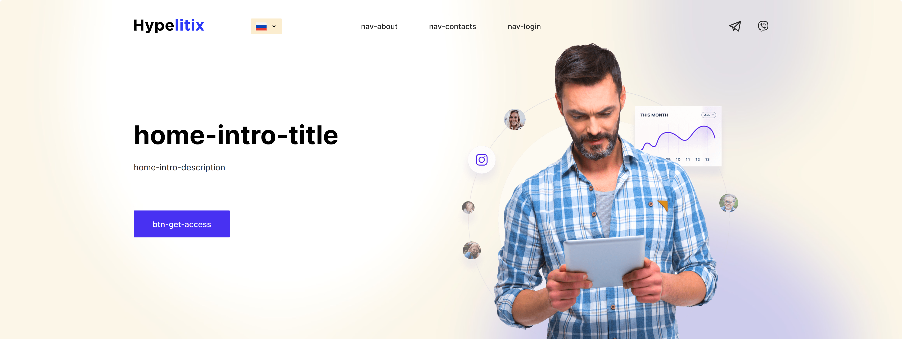

# **Hypelitix**

The **Hypelitix** website analyzes Instagram account data. But in the case of this project, it's an advertising site. See [**demo**](https://dmitrytavern.github.io/website-makeup-hypelitix/).

**Developers:**

- [Dmitry Tavern (developer)](https://github.com/dmitrytavern).
- [Lyovushkin Kyrylo (designer)](https://www.instagram.com/k.lyovushkin/).

**Screenshot:**


## Formulation of the problem

Create a cross-browser, adaptive website by design in Sketch. Key points for adaptability: **375px**, **768px**, **1100px**, **1600px**. There are no additional requirements.

Pages to create:

- [Home](https://dmitrytavern.github.io/website-makeup-hypelitix/)
- [Prices](https://dmitrytavern.github.io/website-makeup-hypelitix/prices.html)
- [Contacts](https://dmitrytavern.github.io/website-makeup-hypelitix/contacts.html)
- [About](https://dmitrytavern.github.io/website-makeup-hypelitix/about_en.html)
- [Content page (privacy policy)](https://dmitrytavern.github.io/website-makeup-hypelitix/privacy-policy_en.html)

## Technologies

&nbsp;
&nbsp;
&nbsp;
&nbsp;
&nbsp;
&nbsp;
&nbsp;
&nbsp;
&nbsp;
&nbsp;
&nbsp;
&nbsp;
&nbsp;
&nbsp;
&nbsp;
&nbsp;
&nbsp;

## Performance

The site loads very quickly and has green positions on all metrics:

&nbsp;
&nbsp;

## Problems

### 01. Implementation of a circular price slider

There is a section on the site to show the user the price for one account at different rates. It could be rendered as a table (as it is done on the [pricing page](https://dmitrytavern.github.io/website-makeup-hypelitix/prices.html)), but to save space, it was decided to make it as a circular slider.

**Solution:** I used Vue, which deals with dot placement, changing the active plan, and so on.


### 02. Implementation of real-time translation

At the last moment I had a requirement that the site should be able to change the localization on the fly without the backend.

**Solution:** For this I used i18n and put all the text into separate json files. The blocks where localized text was used, I marked them with data-i18n, and if it was a link, I marked it with data-i18n-link.



## Conclusions

The project is old and it was not a big problem to make it. However, I highlighted the following mistakes:

- **Hardcore tariffs in the slider.** The number of tariffs should be dynamic, and the price of tariffs can change over time. I didn't take it into account and put everything in js, which, in case of minification, doesn't allow to change tariffs. I should have separated them in json, as it was done with localization.
- **Custom localization.** Although I used i18n, I wrote my own scripts to change the text. I think a better solution could have been found.
- **Development time.** It took me 45 hours to do the site. For a layout like this, it's WAY too long. The slider and localization setup took a lot of time. This was my first time doing both. However, it's still a lot.

## Guide

If you only need a finished build, you can download it from the [latest release](https://github.com/dmitrytavern/website-makeup-hypelitix/releases/latest/download/website-makeup.tar.gz).

This project is obsolete and uses an older version of **Node.js** - **v16.20.0**. There may be errors on newer versions. Make sure you are using this version of Node.js.

There may also be problems running on **Windows** or **MacOs** because the webpack config may not be ready due to different implementation paths.

Steps to manually build a project:

1. Clone a repository:

```
git clone https://github.com/dmitrytavern/website-makeup-hypelitix.git
```

2. Install dependencies:

```
npm ci
```

3. Run a command:

```
npm run dev
npm run build
npm run build:serve
```

- **npm run dev** - launches a live-reload webpack dev server for development.
- **npm run build** - builds the entire project in a production version.
- **npm run build:serve** - runs the production server to test the finished build.

## License

MIT - check repo files

Copyright (c) 2020-present, Dmitry Tavern
